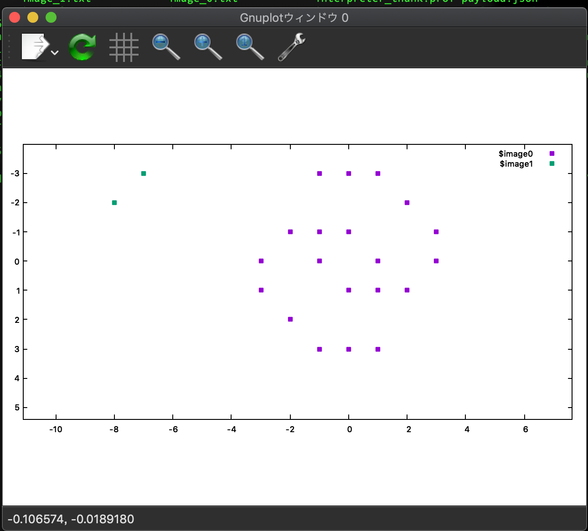
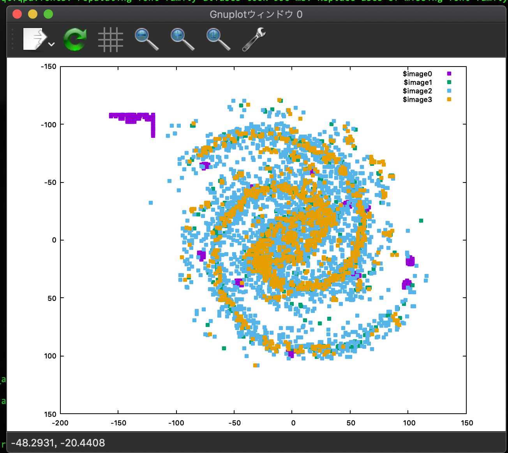

# interpreter

This is our Galaxy Evaluator written in Haskell

## Requirement
- gnuplot
- ruby

- GHC (8.8)


## How to run
You don't have to compile it. The evaluator is deployed on Cloud. 

```
ruby vis.rb
```

Or if the cloud evaluator is down. You can build the evaluator and run in local.

```
cabal new-build
ruby vis.rb --local
```





You can click the window to interact with galaxy pad.

You can change the initial state, by changing
around Line 298 in `vis.rb` 

## How to build

## Docker

```
docker build -t interpreter .
```

## Local

```
cabal new-build
```
